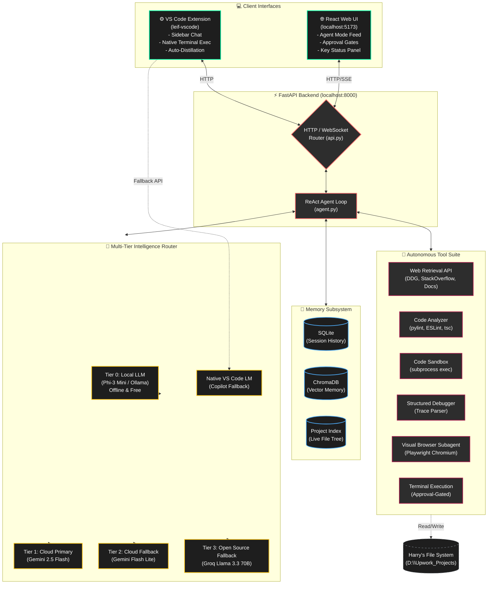

# Leif System Architecture

Here is the complete visual architecture of the Leif System, including the new VS Code Extension integration, the web frontend, the FastAPI backend, and the multi-tier AI Brain.

## System Components Breakdown

### 1. The Client Interfaces
- **React Web UI:** The primary glassmorphic dashboard running on Vite. It features a Generative UI that renders complex React components directly in the chat stream (e.g., Action Lists, Phase Grids) and includes manual approval gates for safety.
- **VS Code Extension (`leif-vscode`):** A newly added native extension that embeds Leif directly into the IDE. It features a native terminal executor, allowing Leif to run commands directly inside your editor. It also has a powerful fallback to VS Code's native Language Models (like Copilot) if the local/cloud APIs fail.

### 2. The FastAPI Backend (`api.py` & `agent.py`)
This is the core orchestrator. It manages the **ReAct (Reason + Act)** loop that you recently upgraded with strict Standard Operating Procedures (SOPs). It breaks down complex Upwork tasks, loops through thoughts and actions, and streams the results back to the clients via Server-Sent Events (SSE).

### 3. The Multi-Tier Brain (`llm_router.py` & `local_llm.py`)
Leif operates on a cascading fallback system to maximize offline capability and minimize cost:
1. **Tier 0:** Fine-tuned Phi-3 Mini running locally via Ollama. It knows your coding patterns and processes simple requests for free.
2. **Tier 1:** Gemini 2.5 Flash (Primary Cloud).
3. **Tier 2:** Gemini Flash Lite.
4. **Tier 3:** Groq Llama 3.3 70B (Fast, free backup if Gemini quota is exhausted).
5. **VS Code Native:** If the backend completely fails, the VS Code extension natively hooks into your active Copilot/VS Code language models to keep working.

### 4. The Autonomous Tool Suite
Instead of guessing, Leif uses deterministic tools:
- **Web Retrieval:** Scrapes real documentation (DuckDuckGo, PyPI, React docs) instead of hallucinating APIs.
- **Code Analyzer & Debugger:** Runs linters and parses stack traces to fix errors before you even see them.
- **Visual Browser Subagent:** Uses Playwright to physically navigate the web, skip ads, read DOM elements, and extract information visually.
- **Project Mapper:** Compresses massive codebases into 2KB indices so the LLM understands the whole project without overflowing its context window.

### 5. Memory Subsystem
- **SQLite:** Handles real-time conversation history.
- **ChromaDB:** A vector database that gives Leif "Semantic Recall" to remember design decisions or preferences you mentioned weeks ago.
- **Distillation Engine:** When Leif successfully finishes a task, the trajectory is saved to `distilled_trajectories.jsonl` to train future versions of her local Tier 0 model.
