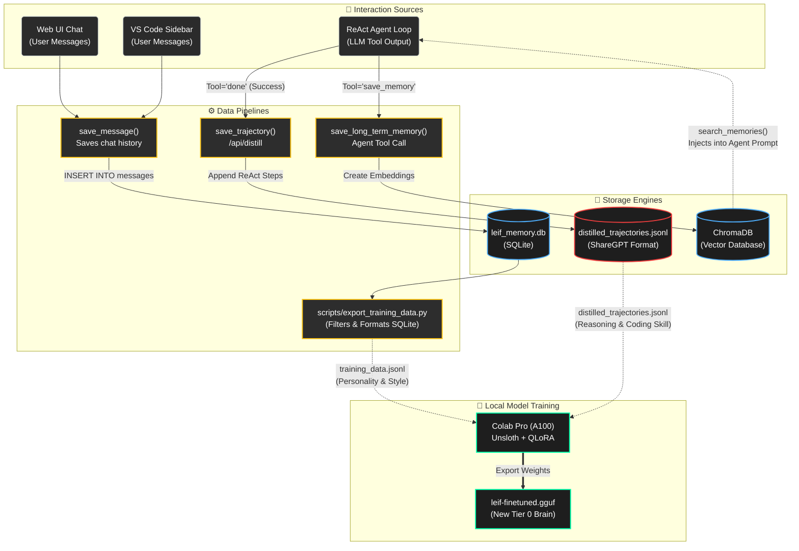

# Training Data & Memory Pipeline

This diagram maps out how Leif collects conversation history, distills reasoning trajectories from cloud models, and stores semantic project context for long-term memory.

## How the Pipelines Work

Leif utilizes a tripartite data and memory system:

### 1. Personality & Style (SQLite Pipeline)
Every time you chat with Leif through the Web UI or VS Code sidebar, the raw `user` and `model` conversation blocks are saved via `database.py` into the `leif_memory.db` SQLite database.
- **Purpose:** To capture how you talk to Leif, how she responds, and your specific coding preferences over time.
- **Training Path:** The `export_training_data.py` script reads this SQLite database, filters out short/junk messages, and exports `training_data.jsonl`.

### 2. Auto-Distillation (Trajectory Pipeline)
This is the core mechanism that makes Leif's offline Tier 0 model smarter. Whenever the expensive cloud models (Gemini Flash, Groq 70B) successfully complete an Agent Loop task, the exact sequence of JSON outputs (the `thought`, `tool`, and `args` flow) is captured.
- **Purpose:** To teach the local, free Phi-3 Mini model *how to reason and use tools like a senior developer*.
- **Training Path:** `save_trajectory()` (or the `/api/distill` endpoint from VS Code) appends the entire loop history to `distilled_trajectories.jsonl` in the standardized ShareGPT format used by Unsloth for fine-tuning.

### 3. Semantic Project Context (ChromaDB Vector Pipeline)
Instead of fine-tuning, which is slow and static, Leif uses ChromaDB for real-time memory recall.
- **Purpose:** To remember specific architectural decisions ("We are using JWT tokens in HTTPOnly cookies") without overflowing the current context window.
- **Path:** Leif's agent loop has access to the `save_memory` tool. When she figures out an important project detail, she creates a dense summary and sends it to ChromaDB. During future tasks, she runs `search_memories()` to automatically inject relevant past context into her system prompt.

### The Fine-Tuning Synthesis
Both the `training_data.jsonl` (SQLite) and `distilled_trajectories.jsonl` (Agent Loop) files are periodically uploaded to a Google Colab notebook running Unsloth. The base model is fine-tuned on this combined dataset, exported as a GGUF file, and loaded back onto your local PC as the new, smarter Tier 0 Brain.
